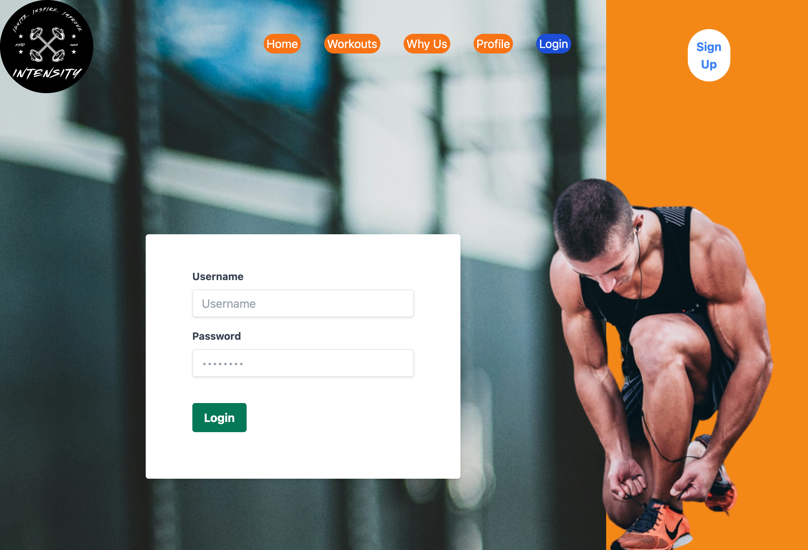
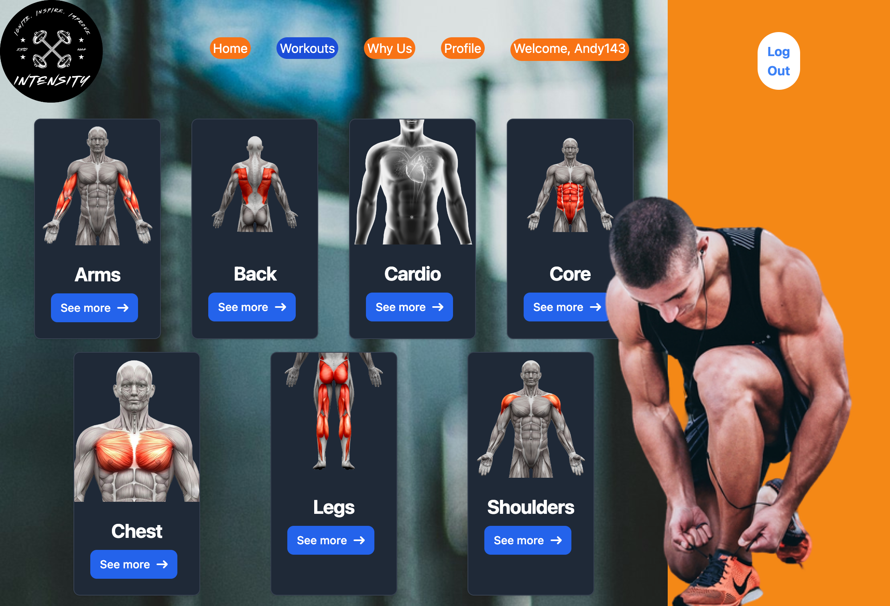
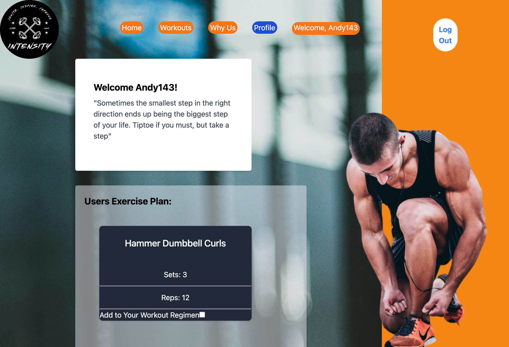

# Intensity

## Table Of Contents
- [Description](#description)
- [Installation](#installation)
- [Dependacies](#dependacies)
- [Usage](#usage)
- [Demo](#demo)
- [Test Sample](#test-sample)
- [Credits](#credits)
- [License](#license)
- [Questions](#questions)

## Description

Meet Intensity – your go-to fitness app for beginners. Get personalized workouts, step-by-step guidance, and community support to kickstart your journey to a healthier you. Download now and start crushing your fitness goals!
*Intensity* is your ultimate fitness companion, empowering clients to take that first leap into your fitness goal. 

## Installation
You can clone the repository here: 
https://github.com/tishaanderson/Intensity

## Dependacies
This application uses the following:

    - BackEnd:
        - Dependacies:
            - Bcrypt v4.0.1
            - JasonWebToken (JWT) v8.5.1
            - Apollo v4.7.1
            - Express v4.17.2
            - GraphQl v16.6.0
            - Mongoose v7.0.2
        - DevDependacies:
            - Nodemon v3.0.3

    - FrontEnd:
        -DevDependacies
            - Concurrently v8.2.0
            - Tailwind v3.4.1

## Usage
Users will be allowed to log in though the `Login` tab on the navigation bar or be able to create their own profile by clicking the `SignUp` button on the homepage. 

Once a user is logged in, they are able to navigate to the `Why Us` tab to learn more about the amazing features we provide.

Users can get started by navigating through out gallery of workouts in the `Workout` tab in the nav bar. Our workouts are arre catagorized by what the user wants to target. Our library consist of catagories such as like `Core`, `Legs`, and much more!
Once the user is ready to select, all they have to do is click the selection box on the bottom left corner of the workout they want to do and `BOOM` it is added to their workout list located in their profiles.

Once the user has completed their desired workout, and want to create a new workout plan, by cchecking off the box in the bottom left hand corner of their workout the user can clear off their comleted exercises and begin a new journey! 

## Demo
Click the logo to start your journey!

## Test Sample

## Credits

- Junior Developer: [Allex Ortiz](https://github.com/allexortiz)
- Junior Developer: [Andrea Gonzalez](https://github.com/H3yJ4yy)
- Junior Developer: [Luis Gonzalez](https://github.com/LgCodes94)
- Junior Developer: [Tisha Anderson](https://github.com/tishaanderson)
-  Junior Developer: [Victor Samuel](https://github.com/VictorSamuel-dev)

## License

=========
- [@vitejs/plugin-react](https://github.com/vitejs/vite-plugin-react/blob/main/packages/plugin-react/README.md) uses [Babel](https://babeljs.io/) for Fast Refresh
- [@vitejs/plugin-react-swc](https://github.com/vitejs/vite-plugin-react-swc) uses [SWC](https://swc.rs/) for Fast Refresh

## Questions
If you have any addition questions feel free to reach us at either the github repository or our email addresses.
- [Intensity GitHub Repo](https://github.com/tishaanderson/Intensity)
- [Allex](allex.ortiz@outlook.com)
- [Andrea](agon0015@gmail.com)
- [Luis](l.gonzalez6@me.com)
- [Tisha](anderson.tisha23@gmail.com)
- [Victor](victorsamuel196@gmail.com)
